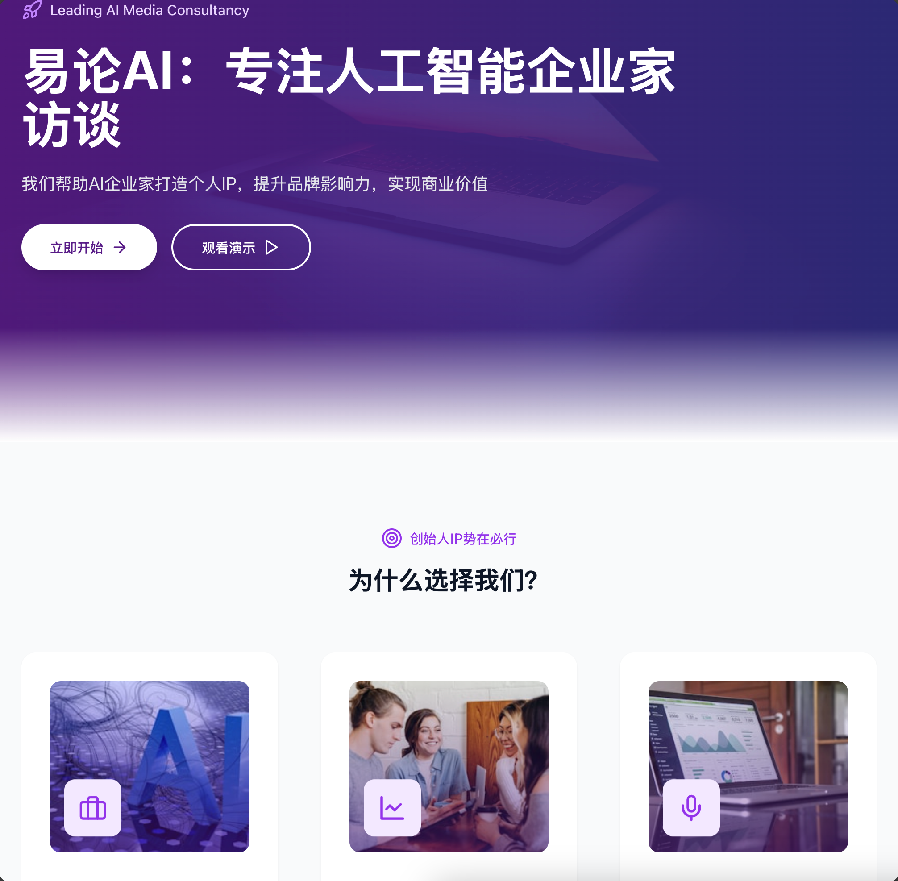

# 易论AI - AI企业家访谈平台


## 项目概述
易论AI是一个专注于人工智能企业家访谈的媒体平台，帮助AI创业者打造个人IP，提升品牌影响力，实现商业价值。本项目采用现代时尚的设计风格，结合丰富的动画效果，为用户提供引人入胜的浏览体验。

## 主要功能
- **商业名片**：人格化的视频版商业名片，降低社交沟通成本
- **获客渠道**：高信任度的获客渠道，单条作品最高获取50+合作线索
- **账号加速**：创始人IP账号启动加速器，精准导流快速起号
- **品牌势能**：帮助品牌在公域端抢占用户心智，实现头部品牌效应
- **权威背书**：通过专业媒体视角，建立硬核身份背书

## 技术栈
- **前端框架**：React + Vite
- **UI库**：Tailwind CSS
- **图标库**：Lucide React
- **动画效果**：CSS动画 + Framer Motion
- **响应式设计**：支持多设备适配

## 项目结构
```
src/
├── App.tsx        # 主应用组件
├── main.tsx        # 应用入口
├── index.css       # 全局样式
└── vite-env.d.ts  # Vite环境类型声明
```

## 开发环境配置
1. 安装依赖：
   ```bash
   npm install
   ```
2. 启动开发服务器：
   ```bash
   npm run dev
   ```
3. 构建生产版本：
   ```bash
   npm run build
   ```

## 项目特色
- **现代设计**：采用渐变背景、卡片式布局等现代设计元素
- **丰富动画**：页面元素加载时带有渐入、缩放等动画效果
- **响应式布局**：完美适配桌面和移动设备
- **图标系统**：使用Lucide图标库，保持视觉一致性

## 发展历程
- 2024年8月：创建易论AI矩阵账号
- 2024年9月：访谈10位AI创业者，粉丝数突破1万
- 2024年11月：访谈50位AI创业者，全网粉丝5万+
- 2025年1月：布局图文媒体矩阵，打造30+平台影响力
- 2025年2月：视频全网播放量突破300万+

## 创始人介绍
**易亚婷**
- 台湾大学本科 / 长江商学院硕士在读
- 全领域资深双语主持人 & 主播
- 福布斯U30（2021）科技类得主
- 深耕AI领域，服务120+中大型企业AI落地

## 联系我们
如有任何问题或合作意向，请通过以下方式联系我们：
- 邮箱：contact@yilunai.com
- 电话：+86 123 4567 8901
